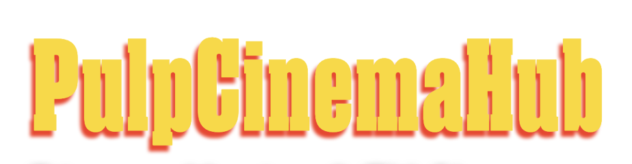
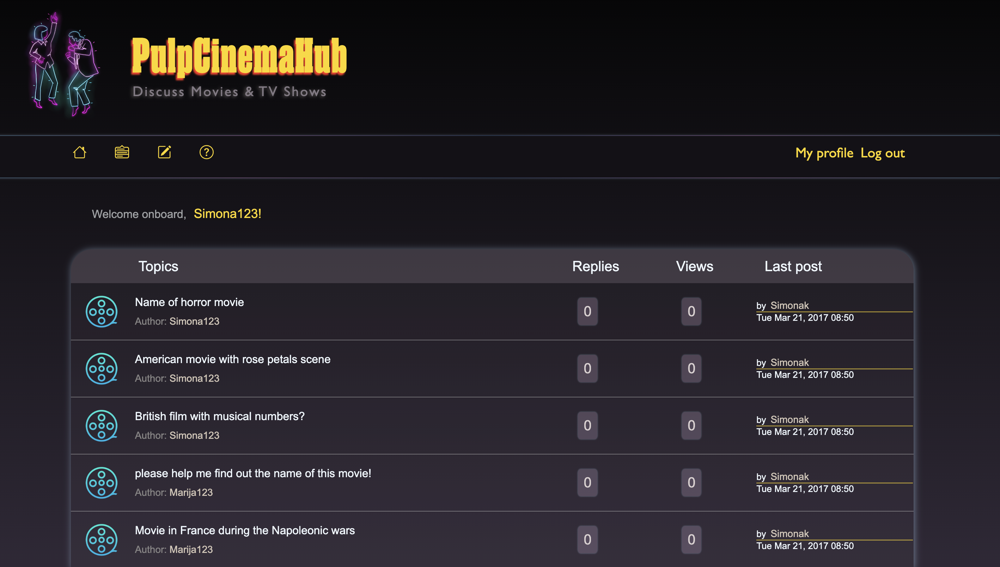

# Project name

<h1 align="center">
  
</h1>
<br/>
<div align="center">
   
   
  
</div>

## Welcome!

This project is mvp of forum fullstack and SSR app. App was created using tailwind, node.js, MongoDB, Javascript, css.

### Prerequisites

- Node.js (v20.10.0 or later)
- MongoDB account and database
- NPM or Yarn installed

# 1. How to launch this project

**[✔] 1.1 Create new `/images` folder in `/public` folder**

**[✔] 1.2 Add `.env` file**

- Create a new file named `.env` in the project root directory.

- To do it propertly copy this code and paste it to your newly created .env file.

- Field SESSIONS_SECRET is meant for sessions security, just thnink of any password and put it there.

### `.env`

```
DB_USER=
DB_PASSWORD=
DB_HOST=
DB_NAME=
SESSIONS_SECRET=

MONGO_CONNECTION=mongodb+srv://__DB_USER:__DB_PASSWORD@__DB_HOST/__DB_NAME
```

**[✔] 1.3 Install dependencies**

- Run `npm install` in the root directory to install the required packages.

**[✔] 1.4 Launch the project**

- Use `node .`, `node app.js`, or `nodemon` (if installed) to start the project.

## Todo

As this project is on going there is a lot more left that needs to be worked on, so this is not a resource for production ready workflow ideas or systems.

Some of the things left to do:
 * Comments on posts
 * Delete profile
 * Create Help section...

## Additional Information

- **Supporting**: Contributions and suggestions are welcome!
- **License**: This project is licensed under the MIT License - see the [LICENSE](LICENSE.txt) file for details. Intention is that you can use everything in this project as a starting point or as a bits and pieces in your own project.


Hope you find this project interesting and useful!



